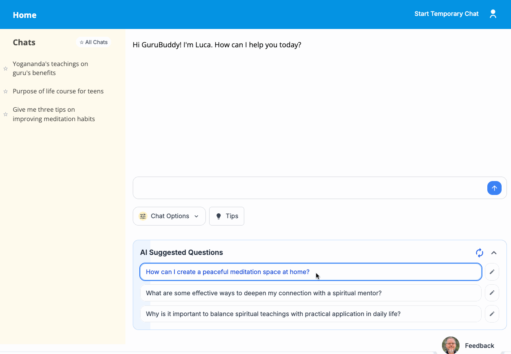
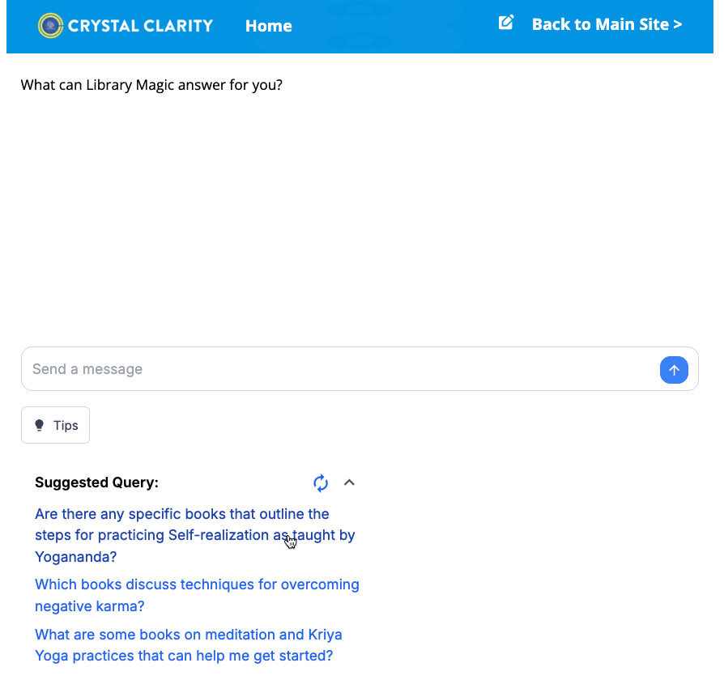

# 🚀 Mega RAG Chatbot - Enterprise Multi-Site AI Knowledge Platform

[](https://github.com/anandaworldwide/mega-rag-chatbot/actions/workflows/tests.yml)
[](https://github.com/anandaworldwide/mega-rag-chatbot/actions/workflows/comprehensive-tests.yml)

**The most advanced open-source RAG (Retrieval-Augmented Generation) system for building intelligent chatbots that
understand your content.** Transform any organization's knowledge base into an AI-powered assistant that provides
accurate, contextual answers with complete source attribution.

## 🎯 Why Choose This RAG System?

### 🏢 **Enterprise-Ready Multi-Site Architecture**

- **Configure unlimited sites** with unique branding, prompts, and data sources
- **Production deployments** serving 4 different organizations simultaneously
- **Granular access control** with user authentication and content-level permissions
- **White-label ready** with customizable UI, logos, and domain mapping

### 📚 **Universal Content Ingestion**

- **PDF Documents** - Advanced semantic chunking with spaCy NLP
- **Audio/Video Files** - Whisper-powered transcription with timestamped playback
- **YouTube Content** - Bulk playlist processing and transcript generation
- **Website Crawling** - Intelligent robots.txt-compliant web scraping
- **Database Integration** - Direct WordPress MySQL database synchronization
- **Real-time Updates** - Automated content change detection and re-ingestion

### 🧠 **Advanced AI Capabilities**

- **Semantic Search** - Vector embeddings with Pinecone for precise content matching
- **Geo-Awareness** - Location-based responses for finding centers and services
- **Context Preservation** - Multi-turn conversations with intelligent question reformulation
- **Conversation History** - AI-generated titles and persistent chat history across devices
- **Streaming Responses** - Real-time answer generation with source attribution
- **Dynamic Follow-up Questions** - AI-generated contextual questions to guide deeper exploration
- **Smart Sharing** - Share specific conversation points with view-only access for recipients
- **Newsletter System** - Engage users with beautiful HTML newsletters featuring one-click unsubscribe

### 🔧 **Developer-Friendly Architecture**

- **Modern Tech Stack** - Next.js 14, TypeScript, React, Python 3.12+
- **Comprehensive Testing** - 200+ tests with Jest, pytest, and integration coverage
- **Production Monitoring** - Built-in analytics, error tracking, and health checks
- **WordPress Plugin** - Drop-in chatbot widget for WordPress sites
- **Docker Ready** - Containerized deployment with environment separation

## 🌟 **Real-World Success Stories**

This system powers AI assistants for:

- **Spiritual Organizations** - 7,000+ documents, 1,500+ audio files, 800+ videos
- **Legal Research** - Complex case document analysis and fact discovery
- **Publishing Houses** - Book catalog search and recommendation systems
- **Educational Institutions** - Course material Q&A and resource discovery

## 🚀 **Quick Start - Get Running Quickly**

```bash
# Clone and setup
git clone https://github.com/anandaworldwide/mega-rag-chatbot
cd mega-rag-chatbot
npm install

# Configure your first site
cp .env.example .env.mysite
# Edit .env.mysite with your API keys

# Ingest your content
npm run ingest:pdf -- --file-path ./your-docs --site mysite --library-name "My Library"

# Launch your AI assistant
npm run dev mysite
```

## 💡 **Perfect For**

- **Organizations** wanting to make their knowledge base searchable via AI
- **Developers** building custom RAG applications with proven architecture
- **Enterprises** needing multi-tenant AI systems with security and compliance
- **Content Creators** looking to make their media library more accessible
- **Researchers** requiring precise source attribution and context preservation

**Ready to transform your content into an intelligent AI assistant?** This battle-tested system handles everything from
data ingestion to production deployment.

## 🎥 **See It In Action**

Experience the power of our RAG system across different organizations:

|                              Ananda Community                              |                             Ananda Public                              |                          Crystal Clarity                           |
| :------------------------------------------------------------------------: | :--------------------------------------------------------------------: | :----------------------------------------------------------------: |
|                  |  |          |
| **Rich media knowledge base** - Chat across PDFs, audio, and video content |       **Public knowledge base** - Accessible spiritual resources       | **Publisher catalog** - Book recommendations and content discovery |

## ⚡ **Feature Showcase**

### 💬 **Intelligent Conversation Management**

Transform every interaction into a persistent, shareable knowledge session:

- **AI-Generated Titles** - Automatic 4-5 word conversation summaries for easy identification
- **Cross-Device Sync** - Conversation history syncs seamlessly across all your devices
- **Smart Sharing** - Share specific conversation points with view-only access up to that moment
- **Star Favorites** - Star important conversations for quick access with dedicated starred conversations view
- **Flexible Privacy** - Choose between public (shared with community) or temporary (not saved) conversations, with
  private (saved but not shared) coming soon
- **Seamless Continuation** - Resume any conversation exactly where you left off
- **Mobile-First Design** - Responsive sidebar with hamburger menu for mobile devices

### 🎨 **Multi-Site Configuration Made Simple**

Configure unlimited sites with unique personalities and data sources:

```json
{
  "ananda-public": {
    "name": "The Ananda.org Chatbot",
    "greeting": "Hi, I'm Vivek. How can I help you?",
    "enableGeoAwareness": true,
    "modelName": "gpt-4o-mini",
    "requireLogin": false
  },
  "crystal": {
    "name": "Crystal Clarity Library Magic",
    "greeting": "What can Library Magic answer for you?",
    "includedLibraries": ["Crystal Clarity"],
    "temperature": 0.2,
    "requireLogin": true
  }
}
```

### 🎯 **Intelligent Content Processing**

- **Semantic Chunking** - spaCy-powered text segmentation preserving context
- **Smart Overlap** - 20% chunk overlap for seamless information continuity
- **Token Optimization** - 600-token chunks optimized for embedding quality
- **Change Detection** - SHA-256 hashing prevents redundant processing
- **Metadata Enrichment** - Automatic author, category, and source attribution

### 🔒 **Enterprise Security & Scalability**

- **JWT Authentication** - Secure user sessions with role-based access
- **Rate Limiting** - Redis-powered request throttling and DDoS protection
- **CORS Security** - Configurable cross-origin policies per site
- **Access Control** - Content-level permissions (public/private/restricted)
- **Audit Logging** - Comprehensive chat history and user analytics

### 🎵 **Rich Media Integration**

- **Audio Playback** - Inline players with transcript synchronization
- **Video Processing** - YouTube integration with timestamp-accurate responses
- **File Security** - S3-backed signed URLs with mobile Safari compatibility
- **Transcription Pipeline** - Whisper AI for high-accuracy speech-to-text

## 📖 **Comprehensive Documentation**

Our battle-tested documentation covers every aspect of deployment and customization:

- [PRD](docs/PRD.md) - Product Requirements Document outlining the project's features and specifications
- [Tech Stack](docs/tech-stack.md) - Overview of technologies used in the project
- [App Flow](docs/app-flow.md) - Explanation of the application's main user flows and interactions
- [Frontend Guidelines](docs/frontend-guidelines.md) - Styling and design rules for the frontend codebase
- [Backend Structure](docs/backend-structure.md) - Architecture and organization of the backend services
- [File Structure](docs/file-structure.md) - Organization of the project's files and directories
- [Login Bootstrap Guide](docs/login-bootstrap-guide.md) - Initial superuser account creation if login is required for a
  site.
- [Security](docs/SECURITY-README.md) - Security implementation details and best practices
- [Security TODO](docs/SECURITY-TODO.md) - Planned security improvements and tasks
- [Testing](docs/TESTS-README.md) - Testing framework and guidelines
- [Testing TODO](docs/TESTS-TODO.md) - Planned testing improvements and tasks
- [Prompt Management](docs/prompt-management.md) - Environment separation and promotion workflow for prompt templates
- [Deployment Guide](docs/deployment-guide.md) - Prompt template deployment procedures and troubleshooting

These documents provide comprehensive guidance for developers working on or extending the project.

## 🏗️ **System Architecture**

Built on modern, scalable architecture principles:

```text
┌─────────────────────────────────────────────────────────────────┐
│                    FRONTEND LAYER                               │
│  Next.js 14 • React 18 • TypeScript • Tailwind CSS            │
│  WordPress Plugin • Admin Dashboard • Mobile-First UI         │
└─────────────────────────────────────────────────────────────────┘
                                  │
┌─────────────────────────────────────────────────────────────────┐
│                    API GATEWAY                                  │
│  JWT Authentication • Rate Limiting • CORS • Security Headers  │
└─────────────────────────────────────────────────────────────────┘
                                  │
┌─────────────────────────────────────────────────────────────────┐
│                  BACKEND SERVICES                               │
│  LangChain RAG • OpenAI LLM • Streaming • Geo-Awareness       │
│  Data Ingestion • Web Crawler • Audio/Video Processing        │
└─────────────────────────────────────────────────────────────────┘
                                  │
┌─────────────────────────────────────────────────────────────────┐
│                    DATA LAYER                                   │
│  Pinecone Vector DB • Firestore NoSQL • Redis Cache • S3       │
└─────────────────────────────────────────────────────────────────┘
```

### 🎉 **What Makes This Special**

- **Battle-Tested in Production** - Serving thousands of users across multiple organizations
- **Zero-Downtime Deployments** - Vercel-optimized with edge function support
- **Intelligent Caching** - Redis-powered performance optimization
- **Mobile-First Design** - Progressive Web App with offline capabilities
- **Extensible Plugin System** - WordPress integration with 50+ configuration options

## 🛠️ **Developer Experience**

### Prerequisites

1. Node.js (version 18+)
2. Python 3.12.3
3. Firebase CLI

### Node.js Setup

Install Node.js from [nodejs.org](https://nodejs.org/) (version 18+)

### Clone the repo or download the ZIP

1. Clone the repo or download the ZIP

   git clone [github https url]

1. Install node packages

```bash
npm install
```

After installation, you should now see a `node_modules` folder.

### Monorepo Workspaces Build

This project uses npm workspaces. After running `npm install` at the root, the project should be ready to use.

```bash
npm install
```

### Environment Variables Setup

1. Copy the example environment file and create site-specific configs:

   ```bash
   cp .env.example .env
   cp .env.example .env.[site]
   ```

   Replace [site] with your specific site name (e.g., ananda).

2. Fill in the required values in `.env`:
   - OPENAI_API_KEY
   - PINECONE_API_KEY
   - PINECONE_INDEX_NAME
   - GOOGLE_APPLICATION_CREDENTIALS
   - Etc.

- Visit [openai](https://help.openai.com/en/articles/4936850-where-do-i-find-my-secret-api-key) to retrieve API keys and
  insert into your `.env` file.
- Visit [pinecone](https://pinecone.io/) to create and retrieve your API keys, and also retrieve your environment and
  index name from the dashboard. Be sure to use 1,536 as dimensions when setting up your pinecone index.
- Visit [upstash](https://upstash.com/) to create an upstash function to cache keywords for related questions.

### Site Configurations

1. Create a new JSON file for your site in the `site-config` directory. Name it `your-site-name.json`.

2. Use the following structure as a template, customizing the values for your site:

```json
{
  "name": "Your Site Name",
  "tagline": "Your site's tagline",
  "greeting": "Welcome message for users",
  etc.
}
```

### Optional: Firebase Emulator Setup

The Firebase Emulator is optional for local development. It is used to simulate the behavior of Firebase services in a
local environment. You don't need it to run the chatbot, but it is useful for local development and debugging, and to
avoid charges for using the Firebase services.

1. Install Firebase CLI:

   ```bash
   npm install -g firebase-tools
   ```

2. Login to Firebase:

   ```bash
   firebase login
   ```

3. Initialize Firebase emulators:

   ```bash
   firebase init emulators
   ```

4. Add to your environment (e.g., .bashrc):

   ```bash
   export FIRESTORE_EMULATOR_HOST="127.0.0.1:8080"
   ```

### Setup python virtual environment

1. Install pyenv (if not already installed):

   For macOS/Linux:

   ```bash
   curl https://pyenv.run | bash
   ```

   For Windows, use pyenv-win:

   ```powershell
   Invoke-WebRequest -UseBasicParsing \
    -Uri "https://raw.githubusercontent.com/pyenv-win/pyenv-win/master/pyenv-win/install-pyenv-win.ps1" \
    -OutFile "./install-pyenv-win.ps1"; &"./install-pyenv-win.ps1"
   ```

2. Install Python 3.12.3:

   ```bash
   pyenv install 3.12.3
   ```

3. Create a virtual environment with pyenv:

   ```bash
   pyenv virtualenv 3.12.3 mega-rag-chatbot
   ```

4. Activate it automatically when you enter the directory:

   ```bash
   pyenv local mega-rag-chatbot
   ```

5. Install Python dependencies:

   ```bash
   pip install -r requirements.txt
   ```

### Python Code Quality and Linting

This project uses [Ruff](https://github.com/astral-sh/ruff) for Python linting and formatting. The configuration follows
PEP 8 standards and includes automatic fixing of common issues.

**Setup for VS Code/Cursor:**

1. Install the Ruff extension: Search for "Ruff" by Charlie Marsh in the Extensions panel
2. The project includes pre-configured settings in `.vscode/settings.json` that will:
   - Enable Ruff as the default linter and formatter
   - Auto-fix issues on save
   - Organize imports automatically
   - Show linting errors in the Problems panel

**Manual linting commands:**

```bash
# Check for linting issues
ruff check .

# Fix auto-fixable issues
ruff check --fix .

# Format code
ruff format .
```

**Note for contributors:** If VS Code/Cursor doesn't auto-detect your Python interpreter, refer to
`.vscode/settings.json.example` for guidance on setting the interpreter path for your specific environment.

## 📊 **Universal Data Ingestion Pipeline**

Transform any content type into intelligent, searchable knowledge:

### 🔄 **Supported Content Sources**

| Source Type            | Features                                        | Use Cases                                |
| ---------------------- | ----------------------------------------------- | ---------------------------------------- |
| **PDF Documents**      | Advanced text extraction, metadata preservation | Legal documents, books, research papers  |
| **Audio Files**        | Whisper AI transcription, speaker detection     | Podcasts, lectures, interviews, meetings |
| **YouTube Videos**     | Bulk playlist processing, subtitle extraction   | Educational content, webinars, talks     |
| **Website Content**    | Intelligent crawling, robots.txt compliance     | Documentation sites, blogs, bases        |
| **WordPress Database** | Direct MySQL integration, category mapping      | CMS content, blog archives, libraries    |

### ⚡ **Processing Pipeline Highlights**

- **Intelligent Chunking** - spaCy NLP ensures semantic coherence across chunk boundaries
- **Duplicate Detection** - SHA-256 hashing prevents redundant processing and storage costs
- **Metadata Enrichment** - Automatic extraction of authors, categories, timestamps, and source attribution
- **Batch Processing** - Optimized for large-scale ingestion with progress tracking and resume capability
- **Quality Assurance** - Built-in validation and error recovery for production reliability

### Ingesting from WordPress Database (Recommended for WP Sites)

This is the primary method for ingesting content originating from a WordPress database. It directly transfers content,
calculated metadata (author, permalink), and **categories** (from specified taxonomies) into Pinecone.

**(Optional) Import MySQL Dump Details:**

The `bin/process_anandalib_dump.py` script helps prepare and import a WordPress SQL dump:

```bash
python bin/process_anandalib_dump.py -u [mysql_username] [path_to_sql_dump]
```

This script (originally for Ananda Library) creates a dated database (e.g., `anandalib-YYYY-MM-DD`), performs some
preprocessing, and imports the data. It can be adapted for other WordPress dumps.

**Main Steps:**

1. **Ensure Database Access:** Make sure the MySQL connection details (`DB_USER`, `DB_PASSWORD`, `DB_HOST`) are
   correctly configured in your `.env.[site]` file for the target database.
2. **Import Dump (if necessary):** If working with a dump file, use the `bin/process_anandalib_dump.py` script to import
   it into a local MySQL database (see details below).
3. **Run the Ingestion Script:** Execute the `ingest_db_text.py` script:

   ```bash
   python python/data_ingestion/sql-to-vector-db/ingest_db_text.py --site [site] --database [database_name] \
     --library-name "[Library Name]"
   ```

   - `--site`: Your site configuration name (e.g., `ananda`) used for `.env` loading and site-specific settings (like
     base URL, post types, category taxonomy).
   - `--database`: The name of the MySQL database containing the WordPress data.
   - `--library-name`: The name to assign to this library within Pinecone metadata.
   - `--keep-data` (optional): Add this flag to resume ingestion from the last checkpoint. If omitted (or `False`), the
     script will prompt you to confirm deletion of existing vectors for the specified library name before starting
     fresh.
   - `--batch-size` (optional): Number of documents to process in each embedding/upsert batch (default: 50).

4. **Monitor Progress:** The script will show progress bars for data preparation and batch processing.
5. **Verify in Pinecone:** Check your Pinecone dashboard to confirm vectors have been added with the correct metadata,
   including the `categories` field.

### Ingesting Standalone PDF Files

Use this method for PDF files that _do not_ originate from the WordPress database.

1. Place your PDF files (or folders containing them) inside a designated directory (e.g., create
   `pdf-docs/[library-name]/`).
2. Run the ingestion script using one of these commands:

   ```bash
   # Standard ingestion
   npm run ingest:pdf -- --file-path ./pdf-docs/my-library --site [site] --library-name "My Library Name"

   # With deprecation warnings
   npm run ingest:pdf:trace -- --file-path ./pdf-docs/my-library --site [site] --library-name "My Library Name"
   ```

   Arguments:
   - `--file-path`: Path to the directory containing the PDFs
   - `--site`: Your site configuration name (for `.env` loading)
   - `--library-name`: Name for this library in Pinecone
   - `--keep-data` (optional): Resume from checkpoint

3. Check Pinecone dashboard to verify vectors.

### Ingesting from WordPress Database

For WordPress database ingestion, use the Python script directly:

```bash
python data_ingestion/sql_to_vector_db/ingest_db_text.py --site [site] --database [database_name] \
  --library-name "[Library Name]"
```

Arguments:

- `--site`: Your site configuration name (e.g., `ananda`) used for `.env` loading and site-specific settings
- `--database`: The name of the MySQL database containing the WordPress data
- `--library-name`: The name to assign to this library within Pinecone metadata
- `--keep-data` (optional): Resume ingestion from the last checkpoint
- `--batch-size` (optional): Number of documents to process in each embedding/upsert batch (default: 50)
- `--dry-run` (optional): Perform all steps except Pinecone operations

### Crawl Websites and Convert to Embeddings

This repo includes a script to crawl websites and ingest their content.

1. Run the script `python python/data_ingestion/crawler/website_crawler.py` with appropriate arguments.

   ```bash
   python python/data_ingestion/crawler/website_crawler.py --domain yourdomain.com --site [site]
   ```

   - `--domain`: The domain to crawl (e.g., `ananda.org`).
   - `--site`: The site configuration name (e.g., `ananda-public`) used for `.env` file loading.
   - `--continue`: Resume crawling from the last saved checkpoint.
   - `--retry-failed`: Retry URLs that failed in the previous run.
   - `--active-hours`: Specify active crawling times (e.g., `9pm-6am`).
   - `--report`: Generate a report of failed URLs from the last checkpoint and exit.

2. Check Pinecone dashboard to verify vectors have been added for the crawled content.

### Transcribe MP3 files and YouTube videos and convert to embeddings

Put your MP3 files in `data-ingestion/media/`, in subfolders. Create a list of YouTube videos or playlists. Then add
files to the processing queue and process them.

#### Audio files

Add all audio files in a folder hierarchy like this:

```bash
python ingest_queue.py  --audio 'media/to-process' --author 'Swami Kriyananda' --library 'Ananda Sangha' --site ananda
```

#### YouTube playlists

You can add a whole playlist at a time. Or you can give it individual videos.

```bash
python ingest_queue.py \
 --playlist 'https://www.youtube.com/playlist?list=PLr4btvSEPHax_vE48QrYJUYOKpXbeSmfC' \
 --author 'Swami Kriyananda' --library 'Ananda Sangha' --site ananda
```

`--playlists-file` is an option to specify an Excel file with a list of YouTube playlists. See sample file
`youtube-links-sample.xlsx`.

Then process the queue:

```bash
python data_ingestion/audio_video/transcribe_and_ingest_media.py
```

Check Pinecone dashboard to verify your namespace and vectors have been added.

## Running the Development Server

Start the development server for a specific site:

```bash
npm run dev [site]
```

Go to `http://localhost:3000` and type a question in the chat interface!

## Testing Framework

The Mega RAG Chatbot includes a testing suite to help ensure code quality. We're continually improving our test coverage
to make the codebase more robust.

### Test Types

- **Unit Tests**: For React components and utility functions
- **API Tests**: Tests for Next.js API endpoints

### Running Tests

#### JavaScript/TypeScript Tests

```bash
# Run all tests
npm test

# Run tests with coverage report
npm run test:ci

# Run tests in watch mode during development
npm run test:watch

# Run tests for specific files
npm run test:changed -- path/to/file.ts
```

#### Python Tests

```bash
# Run all Python tests
python -m unittest discover -s python/data_ingestion/tests/ -p 'test*.py'

# Run a specific test file
python -m unittest python/data_ingestion/tests/test_file.py
```

### Pre-commit Checks

The repository uses Husky and lint-staged to run tests on changed files before committing, helping catch issues early.

### Testing Tools

- **Jest**: Test runner for JavaScript/TypeScript
- **React Testing Library**: For testing React components
- **node-mocks-http**: For testing Next.js API routes
- **unittest**: Python's built-in testing framework

### Contributing Tests

When adding features or fixing bugs, please consider adding corresponding tests:

1. Create test files in the `__tests__` directory
2. Test both success and failure cases when possible
3. Use the provided test templates as a starting point

## Troubleshooting

In general, keep an eye out in the `issues` and `discussions` section of this repo for solutions.

### General errors

- Make sure you're running the latest Node version. Run `node -v`
- Try a different PDF or convert your PDF to text first. It's possible your PDF is corrupted, scanned, or requires OCR
  to convert to text.
- `Console.log` the `env` variables and make sure they are exposed.
- Make sure you're using the same versions of LangChain and Pinecone as this repo.
- Check that you've created an `.env.[site]` file that contains your valid (and working) API keys, environment and index
  name.
- If you change `modelName` in `OpenAI`, make sure you have access to the api for the appropriate model.
- Make sure you have enough OpenAI credits and a valid card on your billings account.
- Check that you don't have multiple OPENAPI keys in your global environment. If you do, the local `env` file from the
  project will be overwritten by systems `env` variable.
- Try to hard code your API keys into the `process.env` variables if there are still issues.

### Pinecone errors

- Make sure your pinecone dashboard `environment` and `index` matches the one in the `pinecone.ts` and `.env` files.
- Check that you've set the vector dimensions env var OPENAI_EMBEDDINGS_DIMENSION appropriately (e.g., 1536 or 3072).
- Retry from scratch with a new Pinecone project, index, and cloned repo.

## Adding a new site

1. Copy `site-config/config.json` to `site-config/config.[site].json`
2. Edit the new config file with your site's details
3. Write your system prompt in site-config/prompts/[site]-prompt.txt. Be sure above config file references the correct
   prompt for your site.
4. Create .env.[site] and add your site's API keys. Be sure to get a unique GOOGLE_APPLICATION_CREDENTIALS for your
   site.

## Using S3 for Prompts (Optional)

You can store prompt files in AWS S3 instead of the local filesystem. The system will load files:

- With `s3:` prefix from your S3 bucket
- Without prefix from the local filesystem

**Note:** Currently, S3 prompt files are shared between development and production environments. Be cautious when making
changes as they will affect all environments immediately.

1. Configure S3 access in your .env file:

   ```env
   AWS_REGION=us-west-1
   S3_BUCKET_NAME=your-bucket-name
   AWS_ACCESS_KEY_ID=your-access-key
   AWS_SECRET_ACCESS_KEY=your-secret-key
   ```

2. In your site's prompt config (e.g. `site-config/prompts/[site].json`), prefix S3-stored files with `s3:`:

   ```json
   {
     "templates": {
       "baseTemplate": {
         "file": "s3:your-site-base.txt" // Will load from S3
       },
       "localTemplate": {
         "file": "local-file.txt" // Will load from local filesystem
       }
     }
   }
   ```

3. Managing S3 Prompts:

   ```bash
   # Pull a prompt from S3 (and acquire lock)
   npm run prompt [site] pull [filename]

   # Edit the local copy (uses VS Code, $EDITOR, or vim)
   npm run prompt [site] edit [filename]

   # See differences between local and S3 version
   npm run prompt [site] diff [filename]

   # Push changes back to S3 (and release lock)
   npm run prompt [site] push [filename]
   ```

   Example:

   ```bash
   # Full workflow example
   npm run prompt ananda-public pull ananda-public-base.txt
   npm run prompt ananda-public edit ananda-public-base.txt
   npm run prompt ananda-public diff ananda-public-base.txt
   npm run prompt ananda-public push ananda-public-base.txt
   ```

   Features:
   - 5-minute file locking to prevent concurrent edits
   - Automatic versioning through S3 versioning
   - Local staging directory (.prompts-staging)
   - Uses VS Code if available, falls back to $EDITOR or vim
   - Diff command to review changes before pushing

4. Files are stored in the `site-config/prompts/` directory in your S3 bucket

## To activate NPS survey

1. Create a Google Sheet with columns: timestamp, uuid, score, feedback, additionalComments. Rename the tab to
   "Responses".
2. Add your Google Sheet ID to the .env file as NPS_SURVEY_GOOGLE_SHEET_ID
3. Add your survey frequency in days to the .env file as NPS_SURVEY_FREQUENCY_DAYS
4. Get client email from GOOGLE_APPLICATION_CREDENTIALS in .env file and add it to the Google Sheet as an "editor" user
5. Enable the Google Sheets API in your Google Cloud Console:
   - Go to the Google Cloud Console (<https://console.cloud.google.com/>)
   - Select your project
   - Navigate to "APIs & Services" > "Dashboard"
   - Click on "+ ENABLE APIS AND SERVICES"
   - Search for "Google Sheets API" and enable it
6. Make sure your GOOGLE_APPLICATION_CREDENTIALS in the .env file is correctly set up with the necessary permissions

Note: If you encounter any errors related to Google Sheets API activation, check the backend logs for specific
instructions and follow the provided link to activate the API for your project.

## 🔌 **WordPress Plugin Integration**

**Drop-in chatbot widget for any WordPress site** - Zero configuration required!

Our WordPress plugin (`wordpress/plugins/ananda-ai-chatbot`) provides:

- **Seamless Integration** - Add AI chat to any WordPress site in minutes
- **Secure Authentication** - JWT-based user session management
- **Responsive Design** - Mobile-optimized chat bubble and interface
- **Customizable Branding** - Match your site's look and feel
- **Analytics Integration** - Track user engagement and satisfaction

For detailed installation instructions, features, and development setup, please refer to the
[plugin's README file](wordpress/plugins/ananda-ai-chatbot/README.md).

## 🤝 **Join Our Community**

### 🌟 **Why Contribute?**

- **Impact Thousands** - Your code powers AI assistants used by diverse organizations
- **Learn Cutting-Edge AI** - Work with the latest RAG, LLM, and vector database technologies
- **Production Experience** - Contribute to a system handling real-world scale and complexity
- **Open Source Impact** - Help democratize AI-powered knowledge systems

### 🚀 **Get Started Contributing**

1. **🍴 Fork the Repository** - Start your contribution journey
2. **🔧 Set Up Development** - Follow our comprehensive setup guide
3. **🎯 Find Your Focus** - Start with documentation improvements, add tests, or enhance existing features
4. **📝 Submit a PR** - We review all contributions with care and feedback

### 💡 **Contribution Areas**

- **🧠 AI/ML Features** - Improve RAG performance, add new LLM integrations
- **🎨 Frontend/UX** - Enhance user interface and experience
- **🔒 Security** - Strengthen authentication and access control
- **📊 Analytics** - Build better monitoring and insights
- **🌐 Integrations** - Connect with new platforms and services
- **📚 Documentation** - Help others understand and use the system

### 📞 **Community Support**

- **GitHub Discussions** - Ask questions, share ideas, get help
- **Issue Tracker** - Report bugs, request features
- **Documentation** - Comprehensive guides for every use case
- **Code Reviews** - Learn from experienced contributors

**Ready to build the future of AI-powered knowledge systems?** We'd love to have you on the team!
